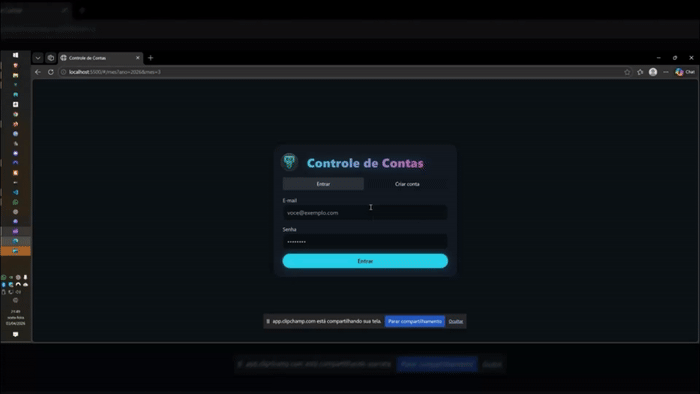
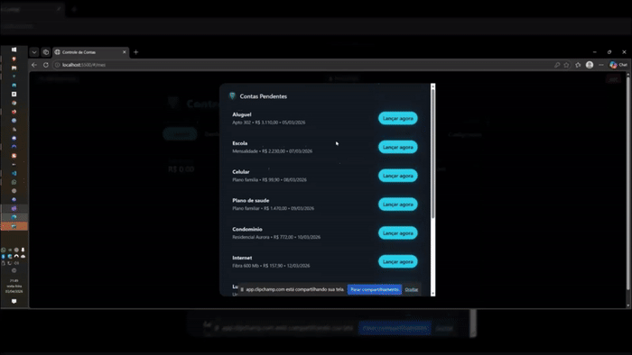
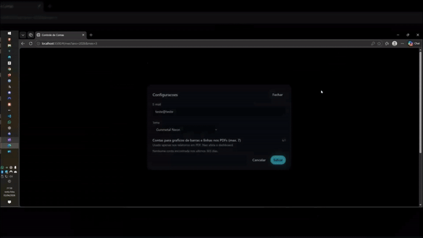
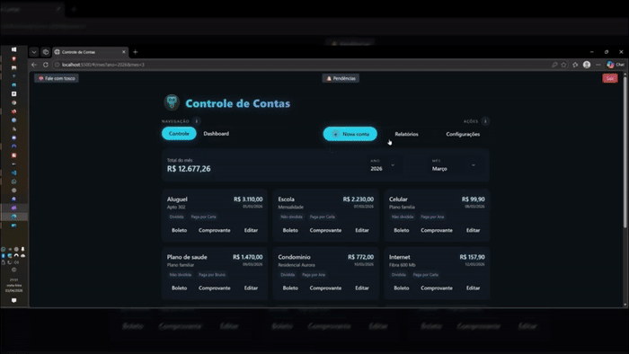
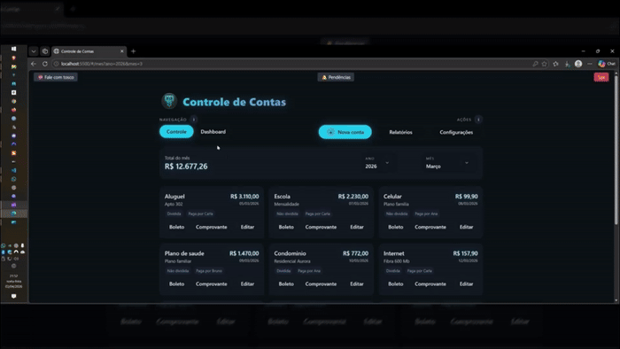
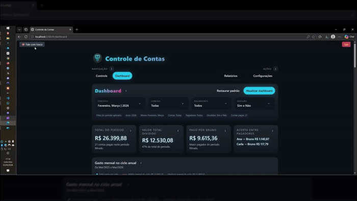

# 💸 Controle de Contas — PWA

**Controle de Contas** é uma aplicação **Progressive Web App (PWA)** feita em **React UMD + Tailwind + Supabase**, voltada para controle financeiro mensal, relatórios formais em PDF e leitura analítica via dashboard BI.

O projeto roda **100% client-side**, sem build tool e sem backend próprio. A ideia central é manter tudo simples para operar em **Supabase free + GitHub Pages**, preservando o fluxo principal do app e acrescentando novas camadas de valor sem aumentar a complexidade operacional.

---

## Demonstração

### Login



### Fluxo principal



### Configurações



### Relatórios



### Dashboard BI



### Fale com Tosco



---

## 🚀 Visão Geral

O app foi desenhado para registrar contas por usuário autenticado, separando cada lançamento por:

- **tipo da conta** (`nome_da_conta`)
- **instância**, quando existir (`instancia`)
- **quem pagou** (`quem_pagou`)
- **se a conta é dividida ou não** (`dividida`)
- **valor**
- **data de pagamento**
- **link de boleto**
- **link de comprovante**

Com esse modelo, o sistema consegue:

- mostrar o **controle mensal**
- destacar **pendências**
- gerar **relatórios mensais e por período**
- exportar **PDFs formais**
- montar um **dashboard BI** com filtros e leitura interativa

---

## ✨ Principais Recursos

- **Autenticação real com Supabase** por e-mail e senha
- **Separação por usuário** com `user_id`
- **Listagem mensal** das contas do período
- **Cadastro, edição e exclusão** de lançamentos
- **Pendências automáticas** comparando mês atual com mês anterior
- **Perfil por usuário**, com tema e preferências
- **Links clicáveis** de boleto e comprovante
- **Relatório mensal em PDF**
- **Relatório por período em PDF**
- **Filtros de data com ano editável e meses completos**
- **Ajuda contextual na home e no modal de Nova conta**
- **Navegação dedicada entre Controle e Dashboard**
- **Dashboard BI em rota própria** (`#/dashboard`)
- **Funcionamento offline básico** com Service Worker
- **Instalação como PWA**

---

## 🧭 Fluxos Principais do Produto

### 1. Controle mensal

Fluxo principal do app:

- login
- seleção de ano e mês
- visualização dos cards e lançamentos do mês
- criação ou edição das contas
- acompanhamento do total do mês

O seletor de data do controle foi desenhado para equilibrar conveniência e liberdade operacional:

- os anos sugeridos partem da base existente no banco
- o ano atual também é garantido na navegação, mesmo que ainda não exista lançamento nele
- o usuário pode digitar e confirmar manualmente qualquer ano válido com quatro dígitos
- os meses permanecem sempre disponíveis de janeiro a dezembro

Na prática, isso evita que o filtro de data vire uma barreira para lançar contas em anos passados, no ano corrente ou em anos futuros ainda sem histórico.

### 2. Pendências

O sistema compara o mês atual com o mês anterior e aponta contas que ainda não foram relançadas.

Esse fluxo existe para acelerar o preenchimento recorrente do mês e continua sendo parte central do controle mensal.

### 3. Relatórios

O modal de relatórios hoje expõe:

- **Relatório mensal**
- **Relatório por período**

Os mesmos seletores de data do fluxo principal são reaproveitados aqui, preservando o comportamento de ano editável com confirmação explícita e meses completos.

O modal continua cobrindo os relatórios formais, enquanto o dashboard concentra a leitura analítica mais rica e interativa em rota própria.

### 4. Dashboard BI

O dashboard organiza a leitura analítica em uma rota própria, sem interferir no fluxo principal do controle mensal.

Ele entra por:

- navegação principal do topo
- rota própria `#/dashboard`

O dashboard trabalha em cima dos mesmos dados do app e respeita o filtro do topo antes de recalcular os blocos analíticos.

### 5. Navegação principal

O topo da aplicação segue um padrão mais explícito de separação entre navegação e ação:

- **Navegação**: `Controle` e `Dashboard`
- **Ações no controle**: `Nova conta`, `Relatórios` e `Configurações`
- **Ações no dashboard**: `Relatórios` e `Configurações`

Esse desenho preserva o fluxo principal do controle mensal e, ao mesmo tempo, deixa claro quando o usuário está trocando de área e quando está apenas abrindo um modal de ação.

Para reforçar essa leitura sem transformar a interface em manual, a home também oferece ajudas contextuais pontuais:

- um `i` em **Navegação**, explicando a diferença entre `Controle` e `Dashboard`
- um `i` em **Ações**, explicando `Nova conta`, `Relatórios` e `Configurações`
- um `i` no topo do modal de **Nova conta**, detalhando campos obrigatórios, opcionais e o uso de links de boleto e comprovante como URLs de referência

Na prática, `Relatórios` segue sendo a entrada para a geração dos relatórios formais em PDF, enquanto a ajuda de `Nova conta` aparece apenas dentro do próprio fluxo de cadastro.

---

## 📊 Dashboard BI

A camada de BI fica isolada em `src/dashboard/` e foi pensada para não misturar análise, controle mensal e relatórios formais na mesma área.

Para manter referência técnica sem poluir a tela ativa, implementações anteriores do dashboard ficam congeladas em `src/dashboard/legacy/`.

Na implementação ativa, sincronias de foco, paginação e normalização dos filtros ficam concentradas em `src/dashboard/orchestration.js`.

### Objetivo do dashboard

Entregar leitura executiva e analítica do período selecionado, mantendo o processamento local e sem custo adicional de infraestrutura.

### Filtros do dashboard

O dashboard trabalha com filtros em abas:

- **Período**
  - anos
  - meses
- **Contas**
  - tipos de conta encontrados no recorte de período
- **Pagador e divisão**
  - pagadores
  - divididas / não divididas

O comportamento é:

- o usuário monta o recorte
- o dashboard só recalcula quando clica em **Atualizar dashboard**
- se o filtro aplicado ficar vazio, o dashboard entra em **estado vazio guiado**

### Blocos analíticos atuais

- **Gráfico principal de gasto mensal do recorte**
- **KPIs principais**
  - total do período ou mês
  - valor total dividido
  - maior pagador do recorte
  - acerto entre pagadores com repasses sugeridos
- **Top 5 contas + Outros**
- **Ranking de gastos**
- **Pareto das contas**
- **Evolução por conta**
- **Balanço dos pagadores**
- **Categorias ao longo do tempo**

### Interação entre blocos

Os blocos principais do dashboard conversam entre si por foco temporário:

- `Pareto`
- `Top 5`
- `Ranking`
- `Evolução por conta`

Ao selecionar uma conta em um desses blocos, os demais sincronizam o destaque dessa mesma conta, sem alterar os filtros reais do topo.

No modo de mês único, esse foco compartilhado também reposiciona automaticamente a paginação do comparativo por conta para levar o usuário até o bloco onde a conta selecionada aparece.

O gráfico principal de gasto mensal trabalha com tooltip por clique: ele compara o mesmo mês do ano anterior, posiciona o mês dentro do recorte e lista as **5 contas** que mais pesaram naquele mês, sem substituir os filtros reais do dashboard.

O card de **Acerto entre pagadores** considera divisão igual entre todos os pagadores visíveis no recorte para as contas marcadas como divididas. Quando houver mais de um repasse, ele lista diretamente as transferências sugeridas no próprio KPI.

No bloco **Balanço dos pagadores**, cada pagador mostra:

- total desembolsado no recorte
- quanto desse valor saiu em contas divididas
- detalhamento dos repasses necessários para equilibrar o recorte

### Regras de UX do dashboard

- o dashboard não altera a lógica do controle mensal
- o dashboard não substitui os relatórios formais
- o botão de `Pendências` não aparece na visão BI
- o usuário pode voltar para `#/mes` a qualquer momento

### Navegação no topo

O header trabalha em duas camadas:

- linha 1: marca do produto (`Controle de Contas`)
- linha 2: navegação principal à esquerda e ações contextuais à direita

Na prática, isso reforça a leitura de que:

- `Controle` e `Dashboard` são áreas da aplicação
- `Relatórios` e `Configurações` são ações modais
- `Nova conta` é uma ação própria da visão de controle

---

## 🧱 Estrutura de Pastas

```text
├─ index.html
├─ manifest.json
├─ sw.js
├─ docs/
│  ├─ architecture-map.md
│  ├─ evolution-roadmap.md
│  └─ regression-checklist.md
├─ README-assets/
│  └─ gifs/
│     ├─ config_final_lite.gif
│     ├─ dashboard_final_lite.gif
│     ├─ fluxo_pricipal_final_lite.gif
│     ├─ fTosco_final_lite.gif
│     ├─ login_final_lite.gif
│     └─ relatorios_final_lite.gif
├─ icons/
│  ├─ icon-192.png
│  ├─ icon-512.png
│  ├─ icon-192-launcher.png
│  └─ icon-512-launcher.png
├─ src/
│  ├─ data-adapter.js
│  ├─ router.js
│  ├─ app-shell/
│  │  ├─ runtime.js
│  │  └─ README.md
│  ├─ post-login/
│  │  ├─ controller.js
│  │  ├─ data.js
│  │  ├─ helpers.js
│  │  ├─ runtime.js
│  │  ├─ workflows.js
│  │  └─ README.md
│  ├─ reports/
│  │  ├─ dom.js
│  │  ├─ helpers.js
│  │  ├─ pdf-builders.js
│  │  ├─ renderers.js
│  │  ├─ workflows.js
│  │  └─ README.md
│  ├─ shared/
│  │  ├─ date-utils.js
│  │  └─ theme-catalog.js
│  ├─ dashboard/
│  │  ├─ DashboardView.jsx
│  │  ├─ helpers.js
│  │  ├─ orchestration.js
│  │  ├─ README.md
│  │  ├─ components/
│  │  │  ├─ DashboardCompositionCharts.jsx
│  │  │  ├─ DashboardFilters.jsx
│  │  │  ├─ DashboardInfoTooltip.jsx
│  │  │  ├─ DashboardRankingPanels.jsx
│  │  │  ├─ DashboardShell.jsx
│  │  │  ├─ DashboardTrendCharts.jsx
│  │  │  └─ README.md
│  │  └─ legacy/
│  │     ├─ DashboardViewLegacy.jsx
│  │     └─ README.md
│  ├─ features/
│  │  ├─ charts.js
│  │  └─ pdf.js
│  ├─ supabase/
│  │  ├─ client.js
│  │  └─ queries.js
│  └─ components/
│     ├─ App.jsx
│     ├─ ContaCard.jsx
│     ├─ EditPopup.jsx
│     ├─ LoginGate.jsx
│     ├─ PostLoginMock.jsx
│     ├─ ReportsModal.jsx
│     ├─ SelectPopoverField.jsx
│     ├─ SettingsModal.jsx
│     ├─ StyleTag.jsx
│     ├─ app-shell/
│     │  ├─ AppChrome.jsx
│     │  └─ README.md
│     ├─ post-login/
│     │  ├─ ControlMonthSummary.jsx
│     │  ├─ MonthlyAccountsPanel.jsx
│     │  ├─ PendingAccountsOverlay.jsx
│     │  ├─ PostLoginHeader.jsx
│     │  ├─ PostLoginToast.jsx
│     │  ├─ SelfChatModal.jsx
│     │  └─ README.md
│     ├─ reports/
│     │  ├─ ReportsPanels.jsx
│     │  └─ README.md
│     └─ shared/
│        ├─ InfoTooltip.jsx
│        ├─ MonthPickerBlocks.jsx
│        └─ README.md
```

### Leitura rápida da estrutura

- `docs/`
  - mapa técnico, roadmap e checklist final de regressão
- `README-assets/`
  - assets visuais da documentação
  - GIFs e capturas usados no README
- `src/app-shell/`
  - runtime pequeno da shell autenticada
- `src/post-login/`
  - helpers, workflows e controller do fluxo principal
- `src/reports/`
  - domínio compartilhado da área de relatórios, preview, render local e builders de PDF
- `src/shared/`
  - utilitários globais pequenos
- `src/dashboard/`
  - camada oficial do BI
- `src/components/`
  - interface principal e componentes de apresentação

---

## 🧠 Arquitetura Real do Projeto

Este repositório não usa bundler. O app mistura:

- **scripts JSX carregados com `type="text/babel"`**
- **módulos ES com `type="module"`**
- **objetos globais em `window`**

### Bootstrap

Arquivos centrais:

- `index.html`
- `manifest.json`
- `sw.js`

Cuidados importantes:

- a ordem de carga dos scripts em `index.html` importa
- qualquer arquivo novo usado em runtime precisa entrar no `index.html`
- qualquer arquivo novo carregado pela app precisa entrar em `sw.js`
- alterações no PWA exigem revisar `APP_VERSION`, query strings e cache

### Contratos globais do runtime

Contratos importantes em `window`:

- `window.SupabaseClient`
- `window.SupabaseQueries`
- `window.SupabaseMutations`
- `window.DataAdapter`
- `window.AppRoutes`
- `window.MOCK_AUTH`
- `window.AppShellRuntime`
- `window.AppDateUtils`
- `window.PostLoginHelpers`
- `window.PostLoginRuntime`
- `window.PostLoginData`
- `window.PostLoginWorkflows`
- `window.PostLoginController`
- `window.ReportsHelpers`
- `window.ReportsDom`
- `window.ReportsRenderers`
- `window.ReportsPdfBuilders`
- `window.ReportsWorkflows`
- `window.DashboardHelpers`
- `window.DashboardOrchestration`

Isso significa que a ordem de carga no HTML funciona como cola de integração entre a parte Babel e os módulos ES.

No estado atual do projeto, o caminho ativo da UI já consome as camadas novas de runtime, dados e workflows. Os globais de compatibilidade continuam existindo como parte do ambiente híbrido, mas deixaram de ser lidos diretamente pelos componentes principais.

### Shell da aplicação

Arquivos centrais:

- `src/app-shell/runtime.js`
- `src/components/App.jsx`
- `src/components/LoginGate.jsx`
- `src/components/app-shell/AppChrome.jsx`
- `src/components/PostLoginMock.jsx`
- `src/post-login/helpers.js`
- `src/post-login/runtime.js`
- `src/post-login/data.js`
- `src/post-login/workflows.js`
- `src/post-login/controller.js`

Responsabilidades:

- sincronizar a sessão do Supabase com o runtime da aplicação
- resolver o hash atual da área principal
- carregar o profile global do usuário
- renderizar o chrome autenticado
- centralizar rotas, eventos globais e toasts do fluxo pós-login
- centralizar composições assíncronas da shell do controle
- orquestrar o fluxo principal do controle

### Fluxos especializados

Arquivos centrais:

- `src/components/ReportsModal.jsx`
- `src/components/reports/ReportsPanels.jsx`
- `src/reports/helpers.js`
- `src/reports/dom.js`
- `src/reports/renderers.js`
- `src/reports/pdf-builders.js`
- `src/reports/workflows.js`
- `src/dashboard/DashboardView.jsx`
- `src/dashboard/components/*.jsx`
- `src/dashboard/helpers.js`
- `src/dashboard/orchestration.js`
- `docs/regression-checklist.md`

Responsabilidades:

- relatórios formais
- exportação de PDF
- leitura analítica do dashboard
- sincronias e paginação do BI
- checklist final de regressão para consolidação

---

## ⚙️ Fluxo de Autenticação

1. `LoginGate.jsx` usa `supabase.auth.signInWithPassword()` para autenticação.
2. Em cadastro, usa `signUp()`.
3. O app mantém a sessão em `window.AppShellRuntime` e espelha o usuário autenticado em `window.MOCK_AUTH` apenas por compatibilidade do ambiente híbrido.
4. `window.AppShellRuntime` preserva `window.SupabaseClient.__lastAuthUid`.
5. O profile do usuário é carregado depois do login.
6. Após autenticar, o fluxo padrão de entrada vai para `#/mes`.

---

## 🧩 Integração com Supabase

O cliente é inicializado em `src/supabase/client.js`.

As leituras e mutações passam por `src/supabase/queries.js`, incluindo:

- listagem mensal
- inserção
- atualização
- exclusão
- leitura de perfil
- gravação de perfil

O `data-adapter.js` organiza esses dados para a UI, lidando com:

- datas
- valores monetários
- nomes
- links
- estrutura consumida pelos cards e pelos relatórios

Tanto o controle mensal quanto o dashboard BI consomem o mesmo pipeline de dados por usuário autenticado.

---

## 🗃️ Banco de Dados

Estrutura esperada:

```sql
create table public.controle_contas (
  id bigint generated by default as identity primary key,
  ano bigint not null,
  mes bigint not null,
  nome_da_conta text not null,
  valor numeric not null,
  data_de_pagamento date not null,
  instancia text null,
  quem_pagou text not null,
  dividida boolean not null,
  link_boleto text null,
  link_comprovante text null,
  user_id uuid not null
);

create table public.profile (
  user_id uuid primary key,
  email text null,
  theme text null,
  chart_accounts text[] null
);
```

### Significado prático do schema

- `nome_da_conta`: tipo da conta, como Escola, Luz, Empregada, Cartão etc.
- `instancia`: detalhamento adicional, como parcela, aluno, unidade, semanal, diária etc.
- `quem_pagou`: pagador responsável naquele lançamento
- `dividida`: informa se entra na lógica de balanço entre pagadores
- `link_boleto` e `link_comprovante`: preservam rastreabilidade do pagamento

---

## 🎨 Interface e Temas

Os temas são injetados por `StyleTag.jsx` com CSS variables.

Temas disponíveis:

- **Gunmetal Neon**
- **Synthwave Teal**
- **Titanio Azul**
- **Cobre Industrial**
- **Aco Neblina**
- **Claro Metálico**

O dashboard respeita o tema ativo da aplicação.

---

## 📑 Relatórios e PDFs

O app possui dois relatórios formais principais:

- **Relatório mensal**
- **Relatório por período**

A home do modal de relatórios foi simplificada para priorizar esses dois relatórios formais. O dashboard BI segue disponível por navegação própria no topo da aplicação.

### Relatório mensal

Gera um PDF com:

- capa executiva com gráfico mensal em barras
- média do recorte recente e destaque visual do mês selecionado
- Top 5 contas do mês
- card de balanço/resumo do mês
- páginas seguintes preservando o fluxo formal já existente

### Relatório por período

Gera um PDF com:

- capa executiva com gráfico mensal do recorte
- meses de contexto adicionais quando o recorte tem menos de 13 meses
- destaque visual dos meses realmente selecionados quando existe contexto adicional
- Top 5 contas acumulado no período
- card de outras contas quando necessário, com capacidade expandida para detalhar mais itens na capa
- comparativos por conta em PDF usando colunas, linha de tendência e média da conta
- tabelas segmentadas por mês

No bloco `Outras contas`, a capa alterna dinamicamente entre uma ou duas colunas conforme o volume listado, preservando o espaço útil para nome e valor sem sacrificar legibilidade.

### Comparativos auxiliares

Os comparativos continuam disponíveis no modal, mas deixaram de ser o caminho principal de leitura analítica.

O motivo é simples: o dashboard BI cobre melhor a leitura exploratória sem duplicar tanta navegação.

---

## 📈 Gráficos

O app usa **Chart.js 3.9.1** e **chartjs-plugin-datalabels**.

Tipos utilizados no sistema:

- pizza e rosca de composição
- barras comparativas
- barras de tendência mensal
- comparativos por conta em PDF de período com colunas, linha de tendência e média
- Pareto
- composições analíticas do dashboard

### Regra prática de leitura visual

- os gráficos executivos de barras e os visuais principais do dashboard priorizam leitura absoluta do gasto
- os comparativos por conta no PDF de período equilibram magnitude absoluta e tendência local usando colunas em zero, linha de conexão e linha média
- os valores absolutos desses comparativos continuam explícitos em labels, para evitar leitura enganosa só pela inclinação da linha ou pela altura relativa da coluna
- o gráfico principal do dashboard usa tooltip por clique e detalhe textual, em vez de depender de excesso de informação fixa na área do plot

No dashboard, parte da visualização é feita de forma mais leve e customizada, sem depender de uma nova biblioteca pesada de BI.

---

## 🤬 Fale com Tosco

Existe um microfluxo cômico chamado **Fale com Tosco**.

Ele:

- não usa IA real
- não envia nada para backend
- responde localmente com frases fixas e aleatórias
- serve como easter egg do projeto

Gatilho:

- topo do app, na área pós-login

Lógica central:

- `App.jsx`
- `PostLoginMock.jsx`

---

## 📱 Navegação SPA

O roteamento é hash-based:

- `#/mes` → controle mensal
- `#/relatorios` → abre o modal de relatórios
- `#/dashboard` → dashboard BI

O router fica em `src/router.js` e chama o runtime da shell pós-login. `window.AppRoutes` permanece apenas como espelho de compatibilidade.

Na interface, o padrão atual é:

- `Controle` e `Dashboard` como navegação persistente
- `Relatórios` e `Configurações` como ações contextuais
- `Nova conta` como ação exclusiva da visão de controle
- ícones `i` como ajuda contextual pontual, sem substituir a navegação principal

---

## 💾 PWA, Cache e Atualização

Arquivos principais:

- `manifest.json`
- `sw.js`
- registro no `index.html`

### O que o PWA faz hoje

- instala o app
- mantém cache local dos arquivos do domínio
- funciona offline de forma básica
- tenta assumir a atualização assim que uma nova versão é publicada

### Estratégia atual de atualização

O `sw.js` atual:

- usa `APP_VERSION` versionado
- versiona também o registro do service worker e o manifest
- chama `skipWaiting()` no install
- chama `clients.claim()` no activate
- usa atualização automática via registro do `index.html`
- revalida arquivos same-origin em rede quando possível

### Observação prática

Depois de publicar uma nova versão:

1. abra o app online
2. aguarde o service worker novo assumir
3. faça um hard refresh na primeira validação, se necessário

Se a PWA instalada estiver presa numa versão antiga, limpar os dados do site ou do app resolve.

---

## 🧪 Execução Local

Para validar corretamente:

- service worker
- manifest
- cache
- fluxo PWA

o ideal é servir por HTTP estático.

Exemplo:

```powershell
py -m http.server 5500
```

Depois abra:

```text
http://localhost:5500/
```

---

## 🚀 Deploy em GitHub Pages

1. publique o repositório
2. aponte o GitHub Pages para a branch ou pasta correta
3. confirme `start_url` e `scope` no `manifest.json`
4. publique
5. abra o app online para permitir atualização do service worker

URL esperada:

```text
https://<usuario>.github.io/controle_contas_pwa/
```

---

## 🛠️ Observações de Manutenção

- o projeto mistura JSX Babel e módulos ES
- globais em `window` fazem parte da arquitetura atual
- mudanças novas devem ser preferencialmente aditivas
- `ReportsModal.jsx` ainda concentra boa parte da orquestração de relatórios
- `PostLoginMock.jsx` já atua mais como shell de composição, apoiado por `src/post-login/controller.js`
- a shell principal agora também usa `src/post-login/controller.js` para estados e efeitos da tela autenticada
- a área de relatórios agora também usa `src/reports/` para DOM auxiliar, renderers locais e workflows
- a área de relatórios usa `src/reports/pdf-builders.js` para a montagem formal dos PDFs mensal e por período
- a shell autenticada também usa `src/app-shell/` e `src/components/app-shell/`
- o caminho ativo da UI não depende mais diretamente de `window.MOCK_AUTH`, `window.AppRoutes`, `window.SupabaseQueries`, `window.AppState` ou `window.PDFHelpers`
- o dashboard deve continuar isolado em `src/dashboard/`
- se adicionar arquivos carregados pela app, atualize `index.html` e `sw.js`
- os mapas técnicos complementares estão em `docs/architecture-map.md` e `docs/evolution-roadmap.md`
- o checklist de regressão para consolidação da branch está em `docs/regression-checklist.md`

---

## 🧭 Créditos e Licença

Desenvolvido por **Roman W. Brocki Neto**.

Projeto pessoal de controle financeiro familiar evoluído para PWA com relatórios e dashboard BI.

Licença: **MIT**
